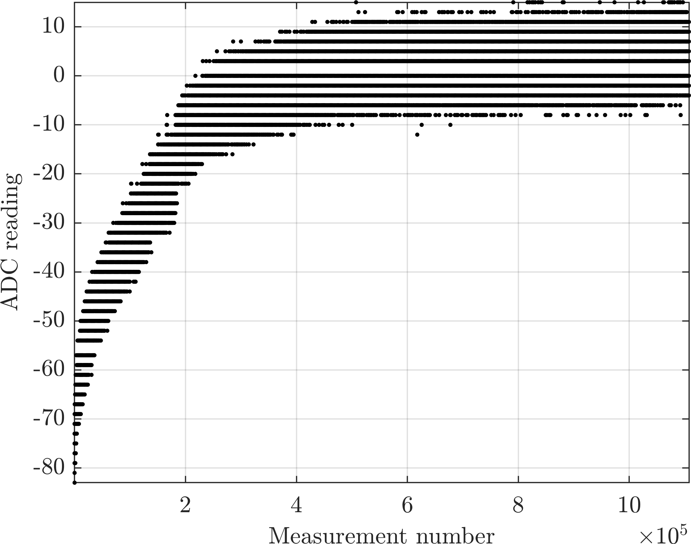

# figureManager
This repository collects functions used to plot large data sets.

Therefore, decimation for various types is implemented and automatically handled by the FigureManager.
It automatically decimates the data set, if interaction takes place.

## Dependencies
The test funcions use the graphics-toolbox: TBD add URL

## Example Plot

